# Employee Directory Management System

README.md

## Overview

A simple PHP and MySQL web application for managing employee records through CRUD operations, search, and department filtering.

The project was developed by following the Software Development Life Cycle (SDLC), including planning, system design, implementation, testing, and documentation.

## Features

- Display employee records
- Add new employee
- Edit employee information
- Delete employee records
- Search employees
- Filter employees by department
- Organized project structure
- Complete SDLC documentation

## Technologies Used

### Programming Languages

- PHP
- HTML5
- CSS3
- SQL

### Database

- MySQL

### Development Tools

- Visual Studio Code
- XAMPP
- phpMyAdmin
- Draw.io

### Documentation

- Markdown (.md)

### Web Browser

- Microsoft Edge


## Project Structure

employee-directory/

├── assets/
│   └── css/
│       └── style.css
│
├── config/
│   └── database.php
│
├── database/
│   └── employee_directory.sql
│
├── docs/
│   ├── diagrams/
│   │   ├── exports/
│   │   └── source/
│   │
│   ├── 00-project-roadmap.md
│   ├── 01-planning.md
│   ├── 02-requirements.md
│   ├── 03-system-design.md
│   ├── 04-database-design.md
│   ├── 05-data-dictionary.md
│   ├── 06-testing.md
│   └── 07-known-limitations.md
│
├── includes/
│   ├── header.php
│   ├── navbar.php
│   └── footer.php
│
├── screenshots/
│
├── add.php
├── delete.php
├── edit.php
├── index.php
├── save.php
├── update.php
│
├── .gitignore
└── README.md


### Folder Description

| Folder/File | Description |
|-------------|-------------|
| assets | Contains CSS and other static resources. |
| config | Database configuration files. |
| database | Database export (.sql) used for setting up the project. |
| docs | Project documentation created throughout the SDLC. |
| includes | Reusable PHP layout components such as the header, navigation bar, and footer. |
| screenshots | Screenshots used in the README and documentation. |
| index.php | Displays the employee list with search and filtering features. |
| add.php | Employee creation form. |
| edit.php | Employee update form. |
| save.php | Processes adding a new employee. |
| update.php | Processes updating employee information. |
| delete.php | Deletes an employee record. |


## System Design

The system was designed following the Software Development Life Cycle (SDLC). The following diagrams were created during the design phase.

| Diagram | Description |
|---------|-------------|
| System Architecture | Shows the overall structure of the application and how users interact with the system. |
| Use Case Diagram | Describes the interactions between the HR Staff and the system. |
| Main Flowchart | Illustrates the overall flow of the Employee Directory Management System. |
| Activity Diagram | Describes the workflow of adding an employee. |
| Entity Relationship Diagram (ERD) | Represents the database structure and relationships. |
| Wireframe | Shows the initial user interface design before development. |

For detailed documentation, see the **docs/** folder.

### System Architecture

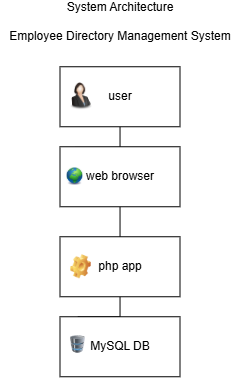

### Use Case Diagram

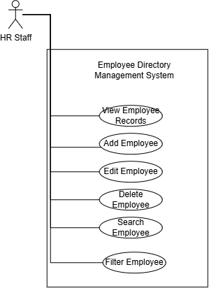

### Main Flowchart

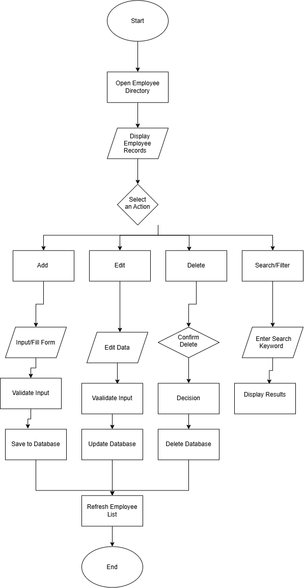

### Activity Diagram

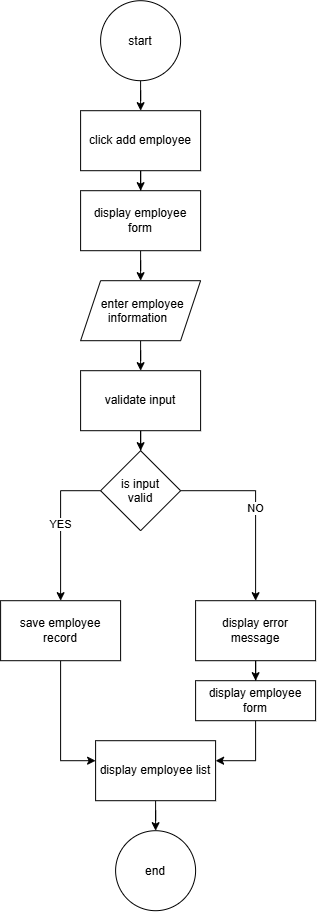

### Entity Relationship Diagram (ERD)


### Wireframe

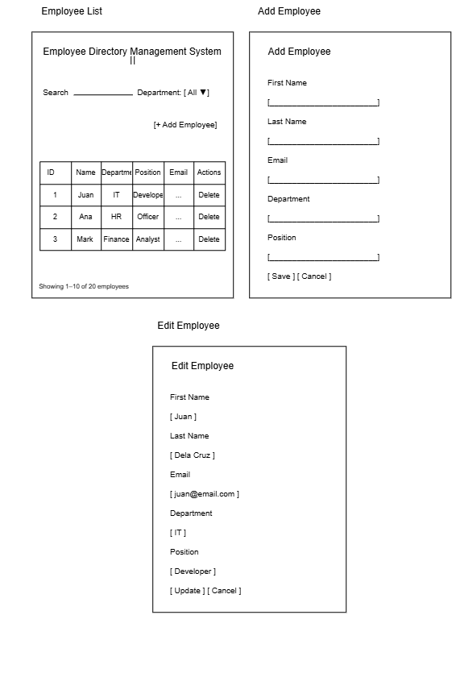


## Installation Guide

### Prerequisites

Before running the project, make sure the following software is installed:

- XAMPP
- Visual Studio Code (optional)
- A modern web browser (Microsoft Edge, Google Chrome, etc.)

---


### Installation Steps

1. Clone or download this repository.

2. Copy the project folder to the XAMPP `htdocs` directory.

Example:

C:\xampp\htdocs\employee-directory

3. Start **Apache** and **MySQL** using the XAMPP Control Panel.

4. Open **phpMyAdmin**.

5. Create a new database named:

employee_directory

6. Import the SQL file located in:

database/employee_directory.sql

7. Open your web browser and visit:

http://localhost/employee-directory/

The application should now be running successfully.

### Default URL

http://localhost/employee-directory/


## Screenshots

### Home Page

Displays the homepage.

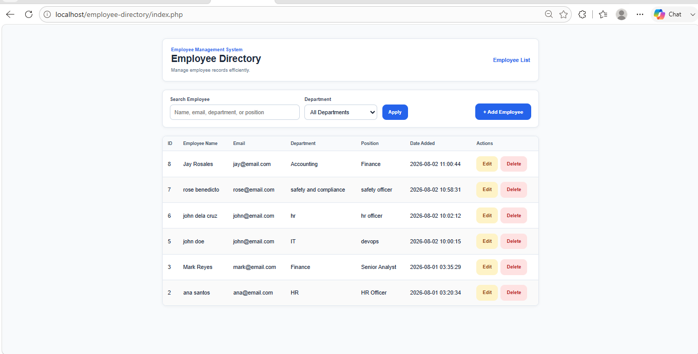

---

### Add Employee

Form for adding a new employee.

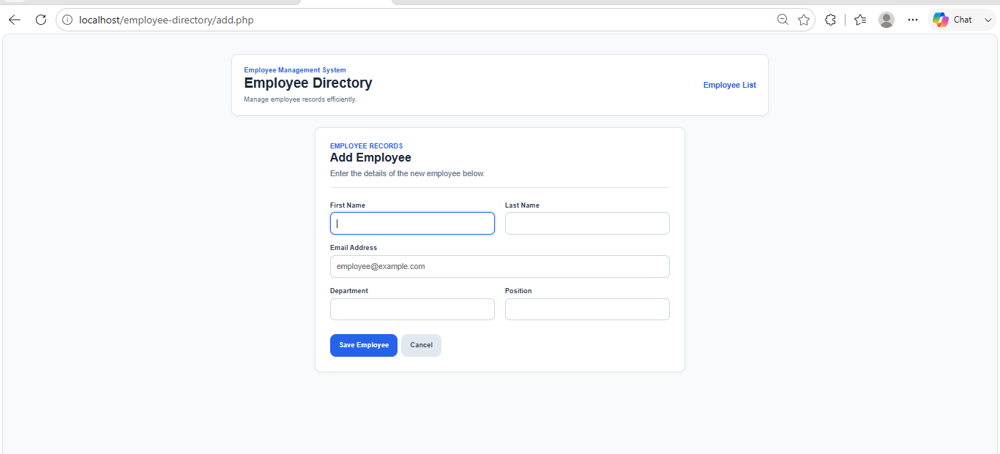

---

### Edit Employee

Form for updating employee information.

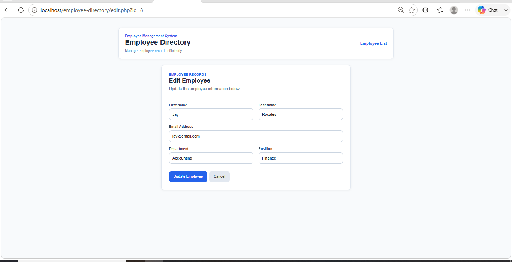

---

### Search Employee

Search employees by name, email, department, or position.

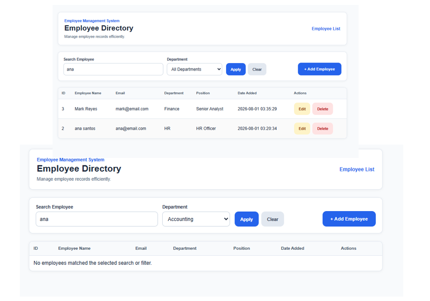

---

### Filter Employee

Filter employees by department.

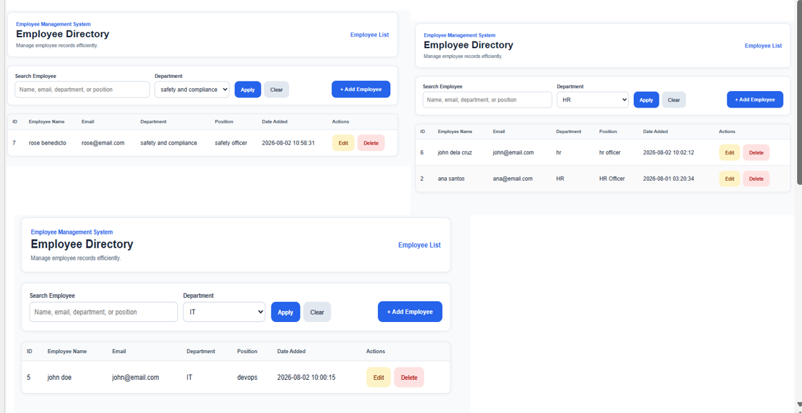

---

### Employee List

Displays all employee records.

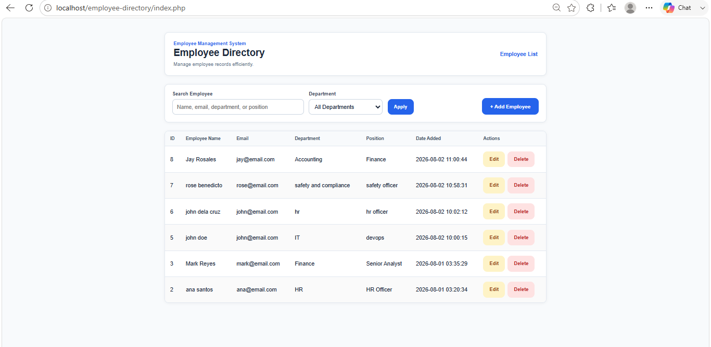


## Testing Documentation

The project was tested after the implementation phase to verify that all core features work as expected.

### Completed Tests

- Functional Testing
- CRUD Testing
- Search Testing
- Filter Testing
- Bug Fixing

A complete testing report is available in:

docs/06-testing.md

# Future Improvements

The following enhancements are planned for future versions of the Employee Directory Management System.

## Search Enhancements

- Support searching by the employee's full name.
- Improve search accuracy and flexibility.

## User Interface

- Improve the overall user interface and user experience.
- Enhance the responsive design for mobile devices.
- Display success and error notifications after CRUD operations.

## Employee Management

- Add pagination for large employee lists.
- Allow sorting by employee name, department, position, and date added.
- Improve form validation and error handling.
- Export employee records to CSV or PDF.

## Security

- Add user authentication.
- Implement role-based access control (Administrator and Standard User).

---

# Planned Features for Version 2.0

Version 2.0 will focus on improving data consistency by introducing a dedicated Department Management module.

## Department Management Module

Create a separate **Departments** module to manage department records independently from employee records.

### Planned Features

- Create a new department.
- Edit an existing department.
- Delete a department.
- Display all departments in a dedicated management page.
- Prevent duplicate department names.

### Employee Form Improvements

Replace the department text field in the **Add Employee** and **Edit Employee** forms with a dynamically populated dropdown list.

Example:

```text
Department

▼ IT
▼ HR
▼ Finance
▼ Accounting

──────────────

+ Add New Department
```

If the required department does not exist, users can create a new department directly from the form.

### Database Improvements

Normalize the database by separating departments into their own table.

Current Structure:

```text
employees
---------
department (VARCHAR)
```

Version 2.0:

```text
departments
-----------
id
department_name
created_at
```

```text
employees
---------
department_id (FK)
```

### Benefits

- Prevents duplicate department names.
- Improves data consistency.
- Simplifies department management.
- Supports database normalization.
- Reduces data redundancy.
- Makes future system expansion easier.

## Author

Developed by **Ara Mae Duco**

This project is created as part of a personal portfolio to practice PHP, MySQL, and the Software Development Life Cycle (SDLC).